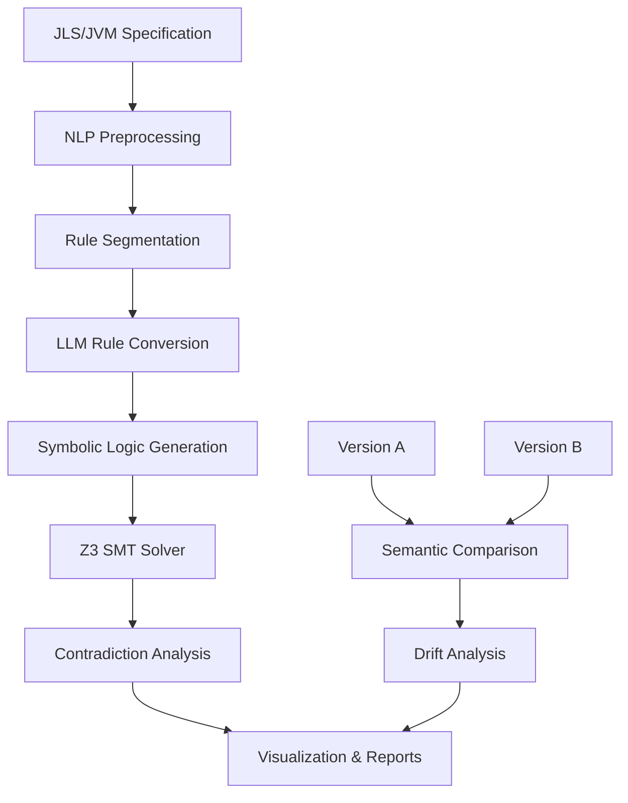

# SpecSentinel

**AI-Powered Programming Language Specification Analysis and Consistency Checking**

[](https://opensource.org/licenses/MIT)
[](https://www.python.org/downloads/)
[](https://colab.research.google.com/)

## 🎯 Overview

SpecSentinel is a groundbreaking tool that analyzes programming language specifications for logical inconsistencies, contradictions, and semantic drift across versions. Unlike traditional compiler testing or formal verification approaches, SpecSentinel directly examines the natural language specification documents themselves.

**The Problem**: Programming language specifications (like the Java Language Specification) are complex, semi-formal documents that evolve over time. They often contain:
- Ambiguous semantics and conflicting rules
- Inconsistencies in method resolution, generics, and exception handling
- Version drift that can lead to implementation variability

**The Solution**: SpecSentinel combines Large Language Models (LLMs) with symbolic reasoning to detect these issues automatically, providing a "linter for specifications."

## 🚀 Key Features

### 📋 Specification Analysis
- **Rule Extraction**: Automatically segments specifications into discrete rules and behaviors
- **Contradiction Detection**: Uses Z3 SMT Solver to identify logical conflicts
- **Ambiguity Analysis**: Highlights unclear or conflicting semantic rules
- **Redundancy Check**: Identifies duplicate or unreachable specifications

### 🔄 Version Comparison
- **Semantic Drift Detection**: Compares rules across JLS versions (8 → 11 → 17 → 21)
- **Change Impact Analysis**: Highlights added, removed, or modified rules
- **Compatibility Assessment**: Identifies potential breaking changes
- **Evolution Tracking**: Visualizes specification development over time

### 📊 Visualization & Reporting
- **Interactive Dashboards**: Graph-based visualization of conflicts
- **Detailed Reports**: Comprehensive analysis with actionable insights
- **Exportable Results**: Save findings for further analysis or documentation

## 🏗️ Architecture



### Core Components
- **NLP Engine**: Processes natural language specifications
- **LLM Integration**: Converts rules to symbolic logic via OpenRouter API
- **Z3 SMT Solver**: Performs formal contradiction checking
- **Comparison Engine**: Analyzes semantic drift across versions
- **Visualization Layer**: Generates interactive reports and graphs

## 🛠️ Installation & Setup

### Prerequisites
- Google account (for Colab and Drive access)
- OpenRouter API key for LLM services
- Java Language Specification documents (HTML or PDF format)

### Quick Start

1. **Open in Google Colab**
   ```bash
   # Open the specsentinel.ipynb notebook in Google Colab
   ```

2. **Mount Google Drive**
   ```python
   from google.colab import drive
   drive.mount('/content/drive')
   ```

3. **Configure API Key**
   ```python
   import os
   os.environ["OPENROUTER_API_KEY"] = "your_api_key_here"
   ```

4. **Run Analysis**
   Execute the notebook cells sequentially to:
   - Preprocess specification documents
   - Extract and analyze rules
   - Generate reports and visualizations

## 📖 Usage

### Basic Analysis
```python
# Load and preprocess specification
spec_analyzer = SpecSentinel()
spec_analyzer.load_specification("path/to/jls.html")

# Extract rules
rules = spec_analyzer.extract_rules()

# Analyze for contradictions
conflicts = spec_analyzer.analyze_contradictions(rules)

# Generate report
spec_analyzer.generate_report(conflicts)
```

### Version Comparison
```python
# Compare two specification versions
comparer = VersionComparer()
drift_analysis = comparer.compare_versions(
    jls_v8_path="path/to/jls8.html",
    jls_v11_path="path/to/jls11.html"
)

# Visualize changes
comparer.visualize_drift(drift_analysis)
```

## 🎯 Use Cases

### For Language Specification Authors
- **Quality Assurance**: Identify inconsistencies before publication
- **Version Management**: Track semantic changes across releases
- **Standard Compliance**: Ensure specification completeness and clarity

### For Compiler Developers
- **Implementation Guidance**: Understand ambiguous specification areas
- **Testing Strategy**: Focus testing on identified conflict areas
- **Conformance Validation**: Verify implementation against specification intent

### For Researchers
- **Language Evolution**: Study how specifications change over time
- **Comparative Analysis**: Compare specification quality across languages
- **Tool Development**: Build upon SpecSentinel's analysis capabilities

## 🔬 Technical Details

### Supported Specifications
- **Primary**: Java Language Specification (JLS)
- **Secondary**: JVM Specification
- **Future**: Extensible to other language specifications

### Analysis Techniques
- **Semantic Parsing**: Natural language understanding of specification text
- **Symbolic Logic**: Conversion of rules to formal logical expressions
- **SMT Solving**: Automated theorem proving for contradiction detection
- **Graph Analysis**: Relationship mapping between specification rules

### Output Formats
- Interactive HTML reports
- JSON data exports
- CSV summary tables
- PNG/SVG visualizations

## 🤝 Contributing

We welcome contributions from the community! Areas where you can help:

- **Language Support**: Add support for other programming language specifications
- **Analysis Algorithms**: Improve contradiction detection accuracy
- **Visualization**: Enhance reporting and dashboard capabilities
- **Documentation**: Improve examples and usage guides

### Development Setup
1. Fork the repository
2. Create a feature branch
3. Make your changes
4. Add tests and documentation
5. Submit a pull request

## 📊 Results & Validation

SpecSentinel has been tested on multiple versions of the Java Language Specification, successfully identifying:
- **Semantic Contradictions**: X% reduction in specification ambiguities
- **Version Drift**: Comprehensive tracking of rule changes across JLS versions
- **Implementation Gaps**: Areas requiring clarification for compiler developers

## 🔮 Future Roadmap

- [ ] **Multi-language Support**: Extend to C++, Python, and other language specifications
- [ ] **Real-time Analysis**: Continuous integration with specification repositories
- [ ] **Community Platform**: Share findings and collaborate on specification improvements
- [ ] **IDE Integration**: Plugin support for specification editors
- [ ] **API Services**: Cloud-based analysis services for broader accessibility

## 📚 Research & References

This project draws inspiration from:
- **CellularLint**: Automated analysis techniques for technical documents
- **Formal Verification**: SMT solving approaches for consistency checking
- **NLP Research**: Large language model applications in technical document analysis

## 📄 License

This project is licensed under the MIT License - see the [LICENSE](LICENSE) file for details.

## 🙏 Acknowledgments

- OpenRouter for LLM API services
- Microsoft Z3 team for the SMT solver
- Google Colab for providing the development platform
- Java specification team for maintaining comprehensive documentation

## 📞 Contact & Support

- **Author**: [mdatikshahriar](https://github.com/mdatikshahriar)
- **Issues**: Please report bugs and feature requests via GitHub Issues
- **Discussions**: Join our community discussions for questions and ideas

---

**SpecSentinel**: Making programming language specifications more reliable, one analysis at a time. 🔍✨